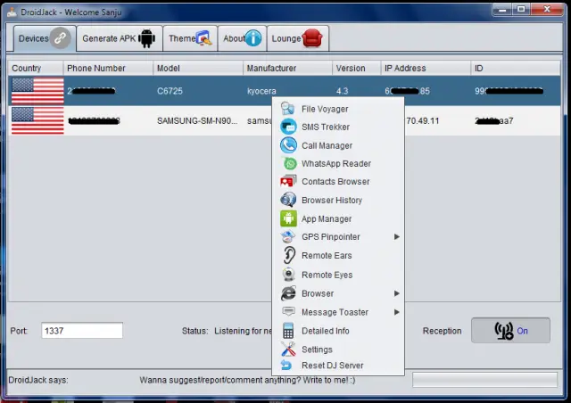

# DroidJack 3.3 - Android Remote Administration Tool


## 🚀 Core Features

### 📱 **WhatsApp Message Interception**
The **flagship capability** of DroidJack 3.3 is its powerful WhatsApp monitoring system:

- **Real-time Message Reading**: View incoming and outgoing messages instantly
- **Media Access**: Download shared photos, videos, and documents
- **Contact Monitoring**: See all WhatsApp contacts and conversation history
- **Stealth Operation**: Operates silently without device user awareness

### 🛠️ Complete Remote Administration Suite

```plaintext
📊 Surveillance Capabilities:
├── Live Screen Streaming
├── Call Log Monitoring (incoming/outgoing/missed)
├── SMS Message Tracking
├── GPS Location Tracking (real-time + history)
├── Ambient Environment Recording
└── Keylogging (captures all keyboard inputs)

📁 System Access:
├── Full File Manager (browse/download/upload)
├── Installed Apps List & Control
├── Camera Snapshots (front/back)
├── Microphone Audio Capture
└── Clipboard Monitoring

⚙️ Control Functions:
├── Remote Command Execution
├── Application Management (install/remove)
├── System Settings Modification
├── Network Information
└── Battery Status Monitoring
